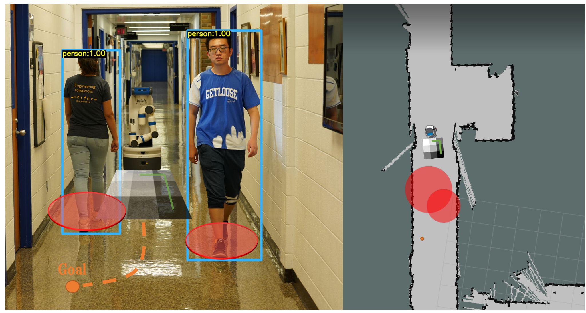
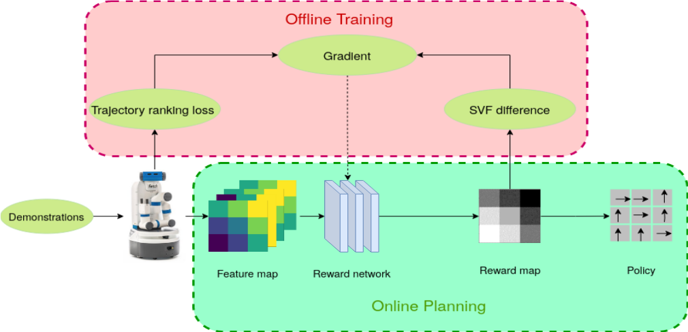

# SoLo T-DIRL

**|[`Paper`](https://arxiv.org/abs/2209.07996) | [`Video`](https://youtu.be/0sNVtQ9eqjA)|**

This repository contains the codes for our ICRA2023 paper. For more details, please refer to the paper
[SoLo T-DIRL: Socially-Aware Dynamic Local Planner based on Trajectory-Ranked Deep Inverse Reinforcement Learning](https://arxiv.org/abs/2209.07996).

## Abstract
This work proposes a new framework for a socially-aware dynamic local planner in crowded environments by building on the recently proposed Trajectory-ranked Maximum Entropy Deep Inverse Reinforcement Learning (T-MEDIRL). To address the social navigation problem, our multi-modal learning planner explicitly considers social interaction factors, as well as social-awareness factors into T-MEDIRL pipeline to learn a reward function from human demonstrations. Moreover, we propose a novel trajectory ranking score using the sudden velocity change of pedestrians around the robot to address the sub-optimality in human demonstrations. Our evaluation shows that this method can successfully make a robot navigate in a crowded social environment and outperforms the state-of-art social navigation methods in terms of the success rate, navigation time, and invasion rate. 


## Method Overview



## Setup
1. Install tensorflow-1.12.0 gpu version.
2. Install [Fetch gazebo](https://docs.fetchrobotics.com/gazebo.html) simulation package.
3. Install [pedsim](https://github.com/srl-freiburg/pedsim_ros) simulation environment following the instruction.
4. Install PID controller ROS package inside your catkin  workspace
```
git clone -b controller https://github.com/UMich-CURLY/Fetch_IRL.git tracking_pid
```
5. Install our SoLo TDIRL package
```
git clone https://github.com/UMich-CURLY/Fetch_IRL.git
```
6. Compile all packages. 
```
cd ~/catkin_ws
catkin_make
```

## Getting Started
This repository is organized into offline training and online testing. 

### Train a reward model.
1. Launch pedsim gazebo simulation environment.
```
roslaunch fetch_irl launch_dynamic.launch
```
2. Collect data. (Before collecting please change the data path and goal pose inside the main function of feature_expect.py)
```
roscd fetch_irl/script
python feature_expect.py
rosrun teleop_twist_keyboard teleop_twist_keyboard.py
```
3. Train the policy
```
python fetch_irl.py
```
### Testing
1. Launch simulation environment.
```
roslaunch fetch_irl launch_dynamic.launch
```
2. Launch SoLo T-DIRL.
```
roscd fetch_irl/script
python main.py
```
3. Use 2D navigation goal button of RViz to naivgate the environment.

## Simulation Videos
SoLo T-DIRL             | SARL
:-------------------------:|:-------------------------:
|
LSTM-RL             |  CADRL
|


## Citation
If you find the codes or paper useful for your research, please cite our paper:
```bibtex
@misc{SoLo_TDIRL,
  doi = {10.48550/ARXIV.2209.07996},
  url = {https://arxiv.org/abs/2209.07996},
  author = {Xu, Yifan and Chakhachiro, Theodor and Kathuria, Tribhi and Ghaffari, Maani},
  keywords = {Robotics (cs.RO), Artificial Intelligence (cs.AI), FOS: Computer and information sciences, FOS: Computer and information sciences},
  title = {SoLo T-DIRL: Socially-Aware Dynamic Local Planner based on Trajectory-Ranked Deep Inverse Reinforcement Learning},
  publisher = {arXiv},
  year = {2022},
  copyright = {Creative Commons Attribution 4.0 International}
}